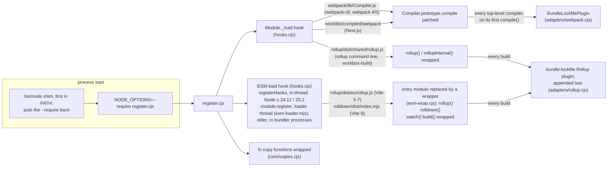
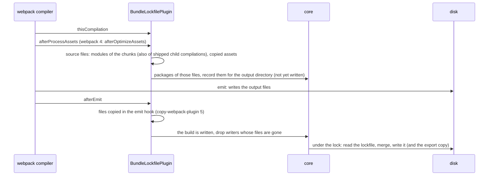
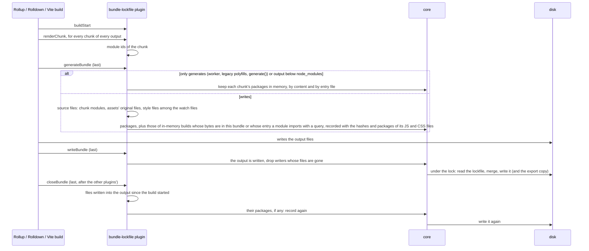
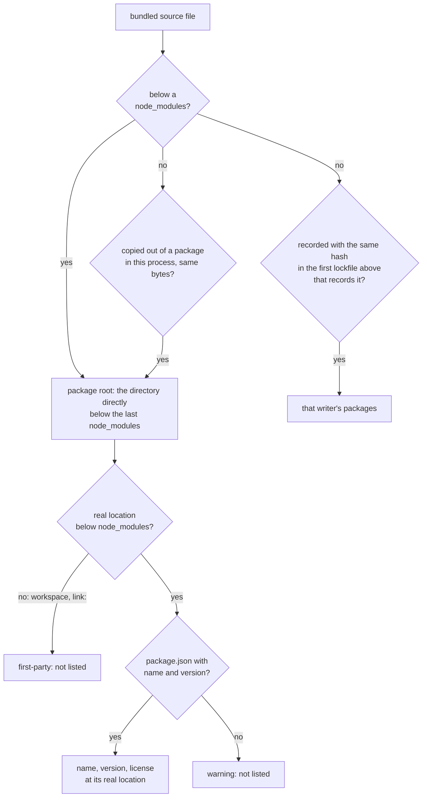
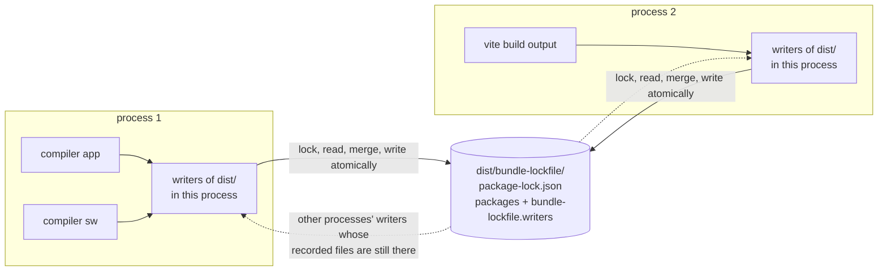

# bundle-lockfile

Records which npm packages end up in a JavaScript bundle and writes them as a `package-lock.json` next to the build
output — without changing the project's build config. Supports webpack 4 and 5 (also the copy inside Next.js), and
Vite, Rollup and Rolldown (also inside SvelteKit).

A lockfile shipped with an application lists everything that was *installed* for the build: build tools, unused and
tree-shaken packages included. `bundle-lockfile` lists only the packages whose files the bundler put into the output,
so SBOM tools such as [syft](https://github.com/anchore/syft) report what is shipped.

## What is listed

The bundler decides what is in the bundle, at build time: starting from the entry points it follows `import`,
`require()` and `import()`, leaves out the modules it can drop — ES modules whose exports are unused and that have no
side effects, declared with `sideEffects` in `package.json` (webpack 5, Rollup and Rolldown also analyze the code) —
and writes the rest into output chunks. bundle-lockfile takes the modules of the chunks the build writes, maps each
module's file to the npm package it belongs to, and lists those packages.

That is *shipped* code, not necessarily *executed* code: lazily loaded chunks that are never opened, branches that
never run, and a package of which only one function is used are all listed. A module that is in a chunk counts even
if none of its code remains: `d3`, which only re-exports `d3-*`, was listed for GitLab (webpack 4) and LibreChat
(Vite) although the source maps show none of its code, and so was `d3-drag` in GitLab, whose code the minifier
removed.

What is shipped depends on the import graph, not on whether a package is declared under `dependencies` or
`devDependencies`. With this project (from the tests):

```json
"dependencies":    { "lodash-es": "4.18.1", "is-number": "7.0.0" },
"devDependencies": { "webpack": "5.111.1", "webpack-cli": "7.2.3", "classnames": "2.5.1", "left-pad": "1.3.0" }
```

where the source code imports only `lodash-es` and `classnames`:

| | reports |
|---|---|
| syft on the project's `package-lock.json` | `lodash-es`, `is-number` (not shipped) and the project itself — but not `classnames` (shipped; skipped as a devDependency) |
| syft on `bundle-lockfile`'s output | `lodash-es`, `classnames` |

Besides the modules of the written chunks, a lockfile lists the packages of:

- **webpack child compilations whose output is shipped**: emitted next to the bundle (workers built by
  `worker-loader`, workbox's `InjectManifest` service worker) or inlined into a bundled module (`worker-loader`'s
  `inline: 'no-fallback'`). Child compilations that only run at build time (html-webpack-plugin's template,
  mini-css-extract-plugin's loader, vanilla-extract's compiler) are not counted.
- **files copied verbatim into a webpack output**, e.g. by `copy-webpack-plugin`, whose assets record the file they
  were copied from. Those of copy-webpack-plugin 5 (webpack 4) do not: such a file counts as the file among the
  compilation's file dependencies in `node_modules` with the same bytes (a copy that was transformed on the way
  matches none).
- **builds that write nothing themselves** (Vite, Rollup, Rolldown): Vite's worker bundles (emitted as files of the main
  build, or inlined with `?worker&inline`), @vitejs/plugin-legacy's polyfills, workbox-build's service worker
  (vite-plugin-pwa), any build that only generates (Rollup's and Rolldown's `generate()`, Vite's `build.write: false`).
  Their chunks' packages are kept in memory, in the process, and listed where the same bytes end up in a written output
  (a chunk or JavaScript asset with that content), or where a module imports the build's entry file with a query
  (`?worker&inline`).
- **style sheets that a style sheet `@import`s from a package** (CSS, Sass, Less, Stylus; inlined into it, so they are
  no modules): in Vite, Rollup and Rolldown builds the style files among the build's watch files. Rolldown provides
  those only on the build object `rolldown()` returns, so Rolldown's `build()` and `watch()` functions — which `vite
  build --watch` on Vite 8 calls — do not list them. In webpack builds the style files among the file dependencies of a
  shipped style module, which its loaders record: Sass partials (sass-loader), Less `@import`s (less-loader),
  postcss-import's and Tailwind's style sheets (postcss-loader).
- **files other plugins write into a Vite, Rollup or Rolldown output after the build** (in a `closeBundle` hook that
  runs before bundle-lockfile's): JavaScript files with the bytes of a chunk of a build that writes nothing itself
  (vite-plugin-pwa's `sw.js` and `workbox-<hash>.js`), and copies of package files (vite-plugin-static-copy). Only
  files modified since shortly before the build started count (2 s, for coarse file-system timestamps); at most
  20,000 entries of the output directory are looked at, files over 20 MiB are compared only if this process copied
  them with fs, and an output directory that contains the working directory is not looked at.
- **copies out of packages** (every bundler): `fs.copyFile`, `fs.copyFileSync`, `fs.cp`, `fs.cpSync` and their
  `fs.promises` versions are wrapped to remember, in the process, which file in `node_modules` a file outside of it
  was copied from (fs-extra and graceful-fs call them, so their copies count). A bundled file, or one written into a
  Vite/Rollup/Rolldown output after the build, that still has the bytes of its source lists the source's package. A
  file written into such an output after the build by another process counts if its path in the output contains
  `node_modules/<package>/` and it has the bytes of that package's file there.
- **nested bundles**: a bundled file outside `node_modules` that another Vite, Rollup or Rolldown build wrote, e.g.
  GitLab's Vite-built "island" `ee/frontend_islands/apps/duo_next/dist/main.js` (Vue inlined), which webpack bundles
  as part of its own code. See [Nested bundles](#nested-bundles).

webpack: a module counts as the file webpack itself names it by (its `nameForCondition`: the path `module.rules`
match it against, also used by `splitChunks` cache-group tests): its resource, or the match resource of a
`<name>!=!<loaders>!<file>` request. Loaders that generate a module from a placeholder file name it that way:
vanilla-extract's CSS reads a placeholder in `@vanilla-extract/webpack-plugin`, which is therefore not listed. A
package file pulled in under a first-party match resource is not listed either.

**Not listed**:
- packages the bundler leaves out: externals, CDN scripts, unresolvable dynamic `require(variable)`
- packages a server loads from `node_modules` at runtime instead of bundling them (see [Next.js](#nextjs),
  [SvelteKit](#sveltekit))
- files other build steps put into the output without going through the bundler, e.g. a
  `cp node_modules/x/dist/x.js dist/` in a script
- files copied out of a package by reading and writing them (not with fs's copy functions), or by another process
  (into a Vite, Rollup or Rolldown output after the build: unless its path there contains `node_modules/<package>/`),
  e.g. `public/` files taken from a package once, by hand
- a package whose only use is a small constant that webpack (>= 5.108, `optimization.inlineExports`, on by default
  in production) inlined at the use site, leaving its side-effect-free module in no chunk
- npm packages vendored inside another package without a `package.json` of their own (e.g.
  `@grafana/google-sdk/dist/esm/node_modules/lodash`): a warning names each one
- (listed although not shipped: a Sass partial with only variables that a style sheet `@import`s lists its package,
  although it adds no bytes)

## Usage

Preload it into the build via `NODE_OPTIONS`; every supported bundler that runs in that process or in a process it
starts (which inherits `NODE_OPTIONS`) is hooked automatically. No config changes, nothing to install into the
project:

```sh
git clone --depth 1 https://github.com/toabctl/bundle-lockfile /opt/bundle-lockfile
export NODE_OPTIONS="--require /opt/bundle-lockfile/src/register.cjs"

npm run build                    # or any other way the build is started:
yarn build                       # yarn 1, yarn 3/4 (also Plug'n'Play)
pnpm run build
npx webpack
./node_modules/.bin/webpack
npx vite build
npx next build --webpack         # Next.js 16 (12-15 build with webpack by default)
```

On Node.js before 24.12 (25.2 on 25), Vite — and Rollup and Rolldown imported as ES modules — are hooked only in
processes whose main script belongs to a package that is or depends on `vite`, `rollup`, `rolldown` or
`rolldown-vite`; a programmatic build from elsewhere needs `BUNDLE_LOCKFILE_ESM_HOOKS=async` (see [Vite, Rollup,
Rolldown](#vite-rollup-rolldown)). Rollup's CommonJS build (`require('rollup')`, the `rollup` command line) is hooked
in every process.

### Keep existing `NODE_OPTIONS`

Append instead of replacing, e.g. when the build already raises the heap limit:

```sh
export NODE_OPTIONS="--max-old-space-size=16384 --require /opt/bundle-lockfile/src/register.cjs"
```

Build scripts that set `NODE_OPTIONS` themselves keep the `--require` only if they pass the old value on: a
default-if-unset script like `NODE_OPTIONS="${NODE_OPTIONS:=--max-old-space-size=10240}" webpack` does, a plain
`NODE_OPTIONS=--max-old-space-size=10240 webpack` (or `cross-env NODE_OPTIONS=... webpack`) drops it. For such
projects, also put the node shim first in `PATH`:

```sh
export PATH="/opt/bundle-lockfile/bin:$PATH"
```

`bin/node` puts the `--require` back into `NODE_OPTIONS`, keeping what else is set (a `--require` of the same file
through another path, e.g. a symlinked install directory, counts as there), and runs the real `node`: the first one
in `PATH` that is neither this shim (nor a copy of it) nor a script it has already passed through on this start.
Every `node` started through `PATH` — by npm, pnpm, yarn, bun, `cross-env` or a shell — then loads bundle-lockfile.
In yarn's own process, `process.execPath` is the shim too: yarn runs scripts with a temporary `node` wrapper first in
`PATH` that runs yarn's `process.execPath`, which leads back to the shim, which then skips the wrapper.
Version managers whose `node` is a script (asdf's and nodenv's shims) are run like such a wrapper; nodenv and asdf
also put the real `node`'s directory first in `PATH` for what they start, so a `node` started from there through
`PATH` bypasses the shim and keeps the `NODE_OPTIONS` it gets. So does a `node` started by its absolute path.
Tested with npm, pnpm, yarn 1, yarn 4 (node-modules linker), bun and `cross-env` (webpack) and npm (Vite).

**Next.js 15.0 – 16.3: use a single `--require`.** These versions rewrite `NODE_OPTIONS` for their build workers and
merge repeated flags: `--require a.cjs --require b.cjs` reaches the workers as the single path `"a.cjs b.cjs"` and the
build fails; with `--require=a.cjs --require=b.cjs` only the last one reaches them
([vercel/next.js#96582](https://github.com/vercel/next.js/issues/96582), fixed in 16.4.0 by
[#96651](https://github.com/vercel/next.js/pull/96651), not backported to 15). Next 12–14 do not parse the flags. If
you need several preloads, require the others from one file.

### Check the result with syft

```console
$ syft scan dir:dist -q
NAME       VERSION  TYPE
debug      2.6.9    npm
lodash-es  4.18.1   npm
ms         2.0.0    npm
ms         2.1.3    npm
nanoid     3.3.20   npm
yallist    5.0.0    npm
```

### See what it does

```console
$ BUNDLE_LOCKFILE_DEBUG=1 npm run build
[bundle-lockfile] webpack: patched Compiler from /app/node_modules/webpack/lib/Compiler.js
[bundle-lockfile] webpack: applying to compiler (unnamed) output /app/dist via /app/node_modules/webpack/lib/Compiler.js
...
[bundle-lockfile] webpack: wrote /app/dist/bundle-lockfile/package-lock.json
```

(More `patched Compiler` lines come from other processes that inherit `NODE_OPTIONS` and load webpack, e.g. Next.js's
build workers; a process that loads webpack but never compiles writes nothing.) Every process also logs how Vite,
Rollup and Rolldown are hooked, e.g. `[bundle-lockfile] ESM hooks: sync (Node 24.21.0)`; a Vite 8 build logs
`[bundle-lockfile] vite: adding the plugin to a rolldown() call` (Vite 7: `rollup()`).

Warnings are always printed, also without `BUNDLE_LOCKFILE_DEBUG`, e.g. for bundled code from a directory in
`node_modules` without a `package.json` with name and version (once per process), a lockfile that could not be
written or locked, `BUNDLE_LOCKFILE_INLINE=0` without an export directory, and a failing adapter (which never fails
the build).

### In a melange package build

```yaml
environment:
  contents:
    packages:
      - bundle-lockfile          # a package that installs src/ to /usr/lib/bundle-lockfile/ (not in Wolfi yet)
  environment:
    NODE_OPTIONS: "--max-old-space-size=16384 --require /usr/lib/bundle-lockfile/register.cjs"

pipeline:
  - runs: |
      yarn install --frozen-lockfile
      yarn build
      # ship the output - the lockfile is inside it
      mkdir -p ${{targets.destdir}}/usr/share/myapp
      cp -r dist ${{targets.destdir}}/usr/share/myapp/
```

An SBOM tool scanning the package contents (e.g. `syft scan dir:`) then finds the bundled npm packages in
`usr/share/myapp/dist/bundle-lockfile/package-lock.json`. If the package also ships the project's own lockfile
(`package-lock.json`, `yarn.lock`, `pnpm-lock.yaml`), syft reports the packages of both. syft does not read lockfiles
in image scans by default: scanning the resulting container image needs
`--select-catalogers +javascript-lock-cataloger`.

The lockfile is part of the build output: if that output is served by a web server (e.g. a `public/assets`
directory), the lockfile is publicly readable too. Steps that process every file of the output process it as well
(SvelteKit's adapter-static with `precompress` writes `package-lock.json.gz` and `.br` next to it).

When the output does not ship as files — embedded into a Go binary (`go:embed`), packed into a jar, gzipped, or copied
away by a step that drops the `bundle-lockfile/` directory (e.g. Next.js' standalone output) — write the lockfiles to
an export directory as well, or only there (`BUNDLE_LOCKFILE_INLINE=0`, which also keeps them out of served
directories), and install that directory:

```yaml
  environment:
    NODE_OPTIONS: "--require /usr/lib/bundle-lockfile/register.cjs"
    BUNDLE_LOCKFILE_EXPORT_DIR: /home/build/bundle-lockfile-export
    BUNDLE_LOCKFILE_EXPORT_BASE: /home/build
    BUNDLE_LOCKFILE_INLINE: "0"

pipeline:
  - runs: |
      make build                 # e.g. webpack into ui/dist, then go build embedding it
      mkdir -p ${{targets.contextdir}}/usr/share/myapp/bundle-lockfile
      cp -r /home/build/bundle-lockfile-export/. ${{targets.contextdir}}/usr/share/myapp/bundle-lockfile/
```

Each lockfile lands at `<export dir>/<its path>`: relative to `BUNDLE_LOCKFILE_EXPORT_BASE` when it is below it,
else its absolute path without the leading `/`. Here `/home/build/ui/dist/bundle-lockfile/package-lock.json` becomes
`usr/share/myapp/bundle-lockfile/ui/dist/bundle-lockfile/package-lock.json` in the package.

### Without NODE_OPTIONS

The plugins can also be added to a config by hand. webpack:

```js
const path = require('path');
const { BundleLockfilePlugin } = require('/opt/bundle-lockfile/src/adapters/webpack.cjs');

module.exports = {
  mode: 'production',
  entry: './src/index.js',
  output: { path: path.join(__dirname, 'dist') },
  plugins: [new BundleLockfilePlugin('bundle-lockfile/package-lock.json')],
};
```

Vite (also Rollup and Rolldown, with `'rollup'` / `'rolldown'`):

```js
import { createRequire } from 'node:module';
const { bundleLockfile } = createRequire(import.meta.url)('/opt/bundle-lockfile/src/adapters/rollup.cjs');

export default { plugins: [bundleLockfile('vite')] };
```

A build that has the plugin in its config does not get it a second time when `NODE_OPTIONS` is set too. Without the
preload, files copied out of packages with fs (see above) are not recorded.

## Output

Each output gets `<output dir>/bundle-lockfile/package-lock.json` (`BUNDLE_LOCKFILE_FILE`): webpack writes one per
top-level compiler, into its `output.path` (placeholders such as `[fullhash]` resolved); Vite, Rollup and Rolldown one
per output of a build that writes, into its `dir` (or the directory of its `file`). Builds that write nothing
themselves and outputs below `node_modules` (e.g. Vite's dependency pre-bundling) get none.

```json
{
  "lockfileVersion": 3,
  "requires": true,
  "packages": {
    "": {},
    "node_modules/debug": { "name": "debug", "version": "2.6.9", "license": "MIT" },
    "node_modules/debug/node_modules/ms": { "name": "ms", "version": "2.0.0", "license": "MIT" },
    "node_modules/ms": { "name": "ms", "version": "2.1.3", "license": "MIT" }
  },
  "bundle-lockfile": {
    "v": 1,
    "context": "../..",
    "writers": [
      { "id": "4c1d0e7a9b2f3c55", "count": 1, "files": ["../main.js"],
        "packages": ["node_modules/debug", "node_modules/debug/node_modules/ms", "node_modules/ms"] }
    ]
  }
}
```

- keys are the packages' real locations (symlinks resolved) relative to webpack's `context` or, for Vite, Rollup and
  Rolldown, the working directory — so nested duplicate versions and pnpm / Yarn Plug'n'Play layouts stay distinct.
  With a context below the project root they start with `../node_modules/`
- the package a file belongs to is the directory directly below the last `node_modules` in its path
  (`node_modules/<name>` or `node_modules/@scope/<name>`): `package.json` files inside a package
  (`dist/esm/package.json`, `preact/hooks/package.json`) are not packages
- a package outside the project — outside the context and not in an ancestor directory's `node_modules`, e.g. in
  Yarn's global cache (Yarn 4's default) or a shared store — is keyed `node_modules/<name>`, or
  `node_modules/<name>@<version>` (then `-2`, `-3`, …) if that is taken, because its real path differs between
  machines
- a package whose real location is outside `node_modules` — a workspace package, a `link:` or `portal:` dependency,
  a `file:` directory dependency installed by npm as a symlink — is first-party and not listed, also with webpack's
  `resolve.symlinks: false`; its dependencies are listed. Yarn 2+ (packs it into its cache) and pnpm (hard-links it
  into `node_modules/.pnpm`) put a `file:` directory dependency inside `node_modules` instead, which makes it a listed
  package
- `name`, `version` and `license` come from each package's own `package.json` (also the legacy `license: {type}` and
  `licenses: [...]` forms). A directory in `node_modules` whose `package.json` has no name or version cannot be
  listed; a warning names it once per process (only a debug message for directories starting with a dot, such as
  `node_modules/.cache`, where tools generate files)
- entries are sorted by name, version and path in code-unit order, so the same build writes the same bytes on every
  machine, whatever its locale
- the root entry has no name, so syft does not report the application itself as a package
- syft's `javascript-lock-cataloger` reads it — in directory and file scans by default, in image scans only when
  selected — unless its path is below a `node_modules` directory, which syft skips for `package-lock.json`. syft
  reads this format only from files named exactly `package-lock.json`

The `"bundle-lockfile"` field is bundle-lockfile's own record; tools that read `package-lock.json` (syft, npm) ignore
it, and it has no machine-specific paths (paths are relative to the lockfile, ids are hashes of the configuration):
- `context`: the directory the keys are relative to
- `writers`: per writer (a webpack compiler, a Vite/Rollup/Rolldown output) its `id`, its `packages` (keys), up to 20
  of its output `files` and their `count`, and — for Vite, Rollup and Rolldown — `outputs`: the SHA-256 of up to 500
  of its JavaScript and CSS files, and `contents`: the packages in each of them (indices into its `packages`), for
  [nested bundles](#nested-bundles)
- `outside` (only if there are any): the keys of packages outside the project, so that another process listing the
  same package does not list it a second time

### Several writers, one lockfile

Builds that write to the same directory share its lockfile: it lists the packages of all of them. In one process
(e.g. a webpack config array whose app and service worker both go to `dist/`, or plugin-legacy's two outputs) they
build in parallel or rebuild in watch mode; separate processes (e.g. two `webpack` or `vite build` commands run by
`concurrently` or `run-p`) find each other's writers in the lockfile on disk and keep their packages as long as one of
the files recorded for them is still there. Each read-merge-write of the lockfile runs under a lock
(`package-lock.json.lock` next to it, or next to the export copy with `BUNDLE_LOCKFILE_INLINE=0`; one older than a
minute is taken over; after 30 s of waiting the write goes ahead without it, with a warning) and replaces the file
atomically, so no process reads a partly written one.

- A writer's packages count once its output is written: a rebuild that fails and is not emitted (webpack's default in
  production) leaves the packages of its previous output in the lockfile.
- A webpack compiler is recognized by its configuration: name, entry, target and file name templates, per output
  directory. A new compiler for the same configuration (e.g. a build restarted in the same process, or run again)
  replaces the previous one's packages — in the same process once that one is closed (webpack < 5.17: no longer
  running); until then both are listed. A Vite/Rollup/Rolldown output is recognized by the kind of build (Vite,
  Rollup, Rolldown), its input, its format, its position among the build's outputs and its entry file name template
  (if it is a string).
- Writers whose files are all gone are left out: e.g. when a webpack compiler's `output.clean` deleted what the
  others had written (on its first build, except paths matching `clean.keep`). If one of its files is left, all its
  packages stay. After a configuration change, a build into a directory that is not cleaned therefore keeps the
  previous build's packages as long as one of its recorded files is still there — also when this build wrote a file
  of the same name: listing a package too many is safer than missing one.
- Where the output is written to the real disk, the lockfile is not a webpack asset: it is written once webpack has
  written the compiler's output (`afterEmit`), so webpack's stats do not list it and plugins that process or upload
  the assets (compression-webpack-plugin, deploy plugins) do not get it. With an in-memory output file system (e.g.
  webpack-dev-middleware's) it is an asset, added after webpack 5's `processAssets` stages (webpack 4:
  `afterOptimizeAssets`); if a plugin deletes it later (compression-webpack-plugin's `deleteOriginalAssets` on
  webpack 4, which runs in the `emit` hook), it is emitted again. In-memory outputs are not shared across processes.

### Nested bundles

Every Vite, Rollup and Rolldown lockfile records the SHA-256 of its JavaScript and CSS files (`outputs`) and the
packages in each (`contents`): a chunk's are its modules' (not those of style sheets Vite took out of it into a CSS
file), a CSS file's those of the style sheets that went into it and of the style sheets they `@import` from packages. For every bundled file outside
`node_modules` — also one of a first-party package linked into it, e.g. a workspace package built by Vite, at its
real location, whether the bundler resolved the link or kept it (webpack's `resolve.symlinks: false`, Vite's
`resolve.preserveSymlinks`) — bundle-lockfile looks at `<dir>/bundle-lockfile/package-lock.json` (`BUNDLE_LOCKFILE_FILE`; or its copy
in the export directory) in the file's directory and each directory above it; in the first lockfile that records the
file, a matching hash adds the packages in that file to this build's (all of the writer's packages if the lockfile
records none per file) — in webpack, Vite, Rollup and Rolldown builds. So a build that bundles only an island's
style sheet gets the packages in it, not those of the island's JavaScript. A file
changed after its build is not attributed. The record travels with the output, so this works across processes, separate
commands and machines. webpack lockfiles record no hashes: a webpack-built bundle that another build bundles is not
attributed.

## Settings

| Variable | Default | |
|---|---|---|
| `BUNDLE_LOCKFILE_FILE` | `bundle-lockfile/package-lock.json` | output path, relative to the bundler's output directory. Keep the file name `package-lock.json` — syft only reads files with exactly that name |
| `BUNDLE_LOCKFILE_EXPORT_DIR` | unset | also write every lockfile below this directory, at `<dir>/<its path>` (see [In a melange package build](#in-a-melange-package-build)) |
| `BUNDLE_LOCKFILE_EXPORT_BASE` | unset | lockfiles below this directory are placed relative to it in the export directory (default: their absolute path) |
| `BUNDLE_LOCKFILE_INLINE` | on | `0`, `false` or `off` (any case): do not write the lockfile into the output directory, only into the export directory (without `BUNDLE_LOCKFILE_EXPORT_DIR` nothing is written; a warning says so) |
| `BUNDLE_LOCKFILE_DEBUG` | unset | log what gets patched and applied to stderr (empty, `0`, `false` and `off` mean off) |
| `BUNDLE_LOCKFILE_DISABLE` | unset | comma-separated names to skip, case-insensitive: `webpack`; `vite` (builds with Vite's plugins), `rollup`, `rolldown` (other `rollup()` / `rolldown()` builds, the `rollup` command line); or `all` |
| `BUNDLE_LOCKFILE_ESM_HOOKS` | `auto` | how Vite/Rollup/Rolldown are hooked (see [Vite, Rollup, Rolldown](#vite-rollup-rolldown)): `sync`, `async` or `off` instead of choosing by Node.js version. `async` uses `module.register`, which Node.js 24.15 / 25.9 deprecate and Node.js 26 warns about |

## Supported

| Bundler | Versions | Notes |
|---|---|---|
| webpack | 4, 5 | webpack < 4 is ignored |
| Next.js (its vendored webpack) | 12, 13, 14, 15, 16 | Next 16 only with `next build --webpack`; its default Turbopack build is not supported |
| Vite | 5, 6, 7 (Rollup 4), 8 (Rolldown 1) | |
| SvelteKit | 2 (Vite 7), 3 (Vite 8) | adapter-static, adapter-node; see [SvelteKit](#sveltekit) |
| Rollup, Rolldown | Rollup 4, Rolldown 1 | builds through their JavaScript API (`rollup()`, `rolldown()`, Rolldown's `build()`, `watch()`) and the `rollup` command line; not the `rolldown` command line yet |

Tested on Node.js 24 and 26, and 22 for Vite, Rollup, Rolldown, nested bundles and SvelteKit (Wolfi's `nodejs-24`,
`nodejs-26` and `nodejs-22`; Next.js 12 itself does not build on Node.js 25 and later, which removed the `SlowBuffer`
its compiled `jsonwebtoken` uses), with npm 8/9/10/11 and the npm on `PATH` (Wolfi's, currently 12), npx, direct `node_modules/.bin`
calls, yarn 1, yarn 3 (Plug'n'Play), yarn 4 (Plug'n'Play, also with the global cache, and node-modules linker), pnpm
8/9/10/11/12 and bun for webpack, and npm, npx, pnpm 10, yarn 1, yarn 4 (Plug'n'Play and node-modules linker) and bun
for Vite — see [`test/matrix.cjs`](test/matrix.cjs). yarn 2 is not tested: it calls `util.isDate`, which Node.js 23
removed, when it sets the times of zip entries from dates (e.g. for `file:` dependencies).

Not yet: rspack, esbuild, Turbopack, the Rolldown command line, Bun's own runtime (`bun --bun`).

### Vite, Rollup, Rolldown

Vite imports Rollup (Vite 5–7) and Rolldown (Vite 8) as ES modules, which `Module._load` does not see. bundle-lockfile
replaces their public entry modules (`rollup/dist/es/rollup.js`, `rolldown/dist/index.mjs`) with a Node.js ESM hook
by a module that re-exports everything and wraps `rollup()` / `watch()` and `rolldown()` / `watch()` / `build()`, and
patches Rollup's CommonJS build when it loads (`require('rollup')`, the `rollup` command line, workbox-build), so that
every such call gets one more plugin, last, unless it has one already. That plugin records the modules of every chunk
when it is rendered (also of chunks a plugin removes later, e.g. vite-plugin-singlefile) and writes the lockfile after
the output is written. `vite dev`, `vite preview` and Vitest write no lockfile: their only builds (such as Vite's
dependency pre-bundling) write below `node_modules` or nothing.

The ESM hook depends on the Node.js version:
- Node.js 24.12, 25.2 and later: `module.registerHooks`, in the same thread, in every process. Before those versions,
  in-thread hooks next to any loader-thread hook (Yarn Plug'n'Play's, tsx's) crash the process (fixed by
  [nodejs/node#60380](https://github.com/nodejs/node/pull/60380)).
- Older versions with `module.register` (18.19, 20.6 and later): a loader thread, only in processes whose main script
  belongs to a package that is or depends on `vite`, `rollup`, `rolldown` or `rolldown-vite` — the `vite` command, a
  build script of a project using Vite, tools such as `headlamp-plugin` — because a loader thread costs time and
  memory in every process. `BUNDLE_LOCKFILE_ESM_HOOKS=async` uses it in every process, `off` in none.

### SvelteKit

`vite build` runs SvelteKit's client and server builds and builds the service worker with a nested Vite build; each
writes its lockfile below `.svelte-kit/output/` (`client/`: the page code, the runtime and the service worker's
packages; `server/`: what the server bundles). The adapter then fills `build/`:
- adapter-static copies the client output, with its lockfile, to `build/`.
- adapter-node copies it to `build/client/`. SvelteKit 3 copies the server output to `build/server/`, with its
  lockfile; adapter-node 5 (SvelteKit 2) bundles the server output once more with Rollup into `build/`, whose lockfile
  lists what is bundled there, including the server output's packages (as a nested bundle) and adapter-node's own
  files, which it copies to `.svelte-kit/adapter-node/` before bundling them (see copies out of packages above).

Dependencies the server imports are not bundled by default (Vite's SSR build and adapter-node keep the project's
`dependencies` external): the server loads them from `node_modules` at runtime, so they are in no bundle-lockfile —
ship that `node_modules` (with its `package.json` files, or `package-lock.json`) for the SBOM, as with Next.js.

### Next.js

Next runs several compilers, so a build writes one lockfile per compiler output (below `distDir`, `.next` by default):
`.next/bundle-lockfile/` (client), `.next/server/chunks/bundle-lockfile/` (server) and `.next/server/bundle-lockfile/`
(edge-server: middleware and routes with `runtime = 'edge'`; without packages if there are none). With the App
Router, the server output uses the React Next vendors (`next/dist/compiled/react`), which is listed as `next`; the
client output lists `react` and `react-dom`.

A static export (`output: 'export'`) copies the pages and `.next/static` into `out/`, not the lockfiles: `out/` has none.
Ship `.next/bundle-lockfile/package-lock.json` with it, or write the lockfiles to an export directory
(`BUNDLE_LOCKFILE_EXPORT_DIR`). In this mode a custom `distDir` names the export destination; Next builds into `.next`
anyway, so that is where the lockfiles are.

Next does not bundle many packages into the **server** output (Pages Router dependencies, packages in
`serverExternalPackages`); the server loads them from `node_modules` at runtime. Next records those runtime files in
`.next/server/**/*.nft.json` (in the test fixture's build: `ms` is only in the client lockfile, and `index.js.nft.json`
lists `ms`, `uuid`, `react`, `react-dom`, … from `node_modules`). Such packages are in no bundle-lockfile; if
`node_modules` is shipped with the server, they are covered by the installed `package.json` files there.

## How it works

### Getting into the build

`register.cjs`, preloaded with `--require`, runs before the build tool's own code. It installs a hook on
`Module._load` (every `require()`) and, depending on the Node.js version (see [Vite, Rollup,
Rolldown](#vite-rollup-rolldown)), an ESM load hook. Each recognizes a bundler's module when it is loaded and patches
it so that every build gets bundle-lockfile's plugin — without a config change.



### What a build does

Both plugins answer the same question — which source files are in the output this build writes? — and hand the
files to the core, which turns them into packages and the lockfile.



(This is the real disk; with an in-memory output file system the lockfile is a webpack asset, added in
`afterProcessAssets`, and written again in `afterEmit` only if other writers share it or files were copied in the emit
hook; the export copy is written after every build.)



### From files to packages



A file outside `node_modules` that is neither a copy nor recorded by another build is first-party and not listed. Vite,
Rollup and Rolldown builds add the packages of builds that write nothing themselves by the content of their chunks
(see [What is listed](#what-is-listed)).

### One lockfile, several writers



Within a process, the writers of an output directory live in a registry shared by every copy of bundle-lockfile that
is loaded (on `globalThis`); each has the packages of its last written build and of the build in progress. Every write
of the lockfile renders their last written builds, plus the writers other processes recorded in the lockfile on disk.

### Files

```
src/register.cjs        NODE_OPTIONS entry point: registers the adapters, installs the hooks and the fs copy wrappers
bin/node                node shim for builds whose scripts overwrite NODE_OPTIONS
src/hooks.cjs           module-load hooks shared by the adapters: Module._load, and the ESM hooks (in-thread, or the
src/esm-loader.mjs        loader thread) that replace entry modules by the wrappers esm-wrap.cjs generates
src/esm-wrap.cjs
src/adapters/webpack.cjs  webpack 4/5 and Next.js: which source files are in a compiler's emitted output
src/adapters/rollup.cjs   Rollup, Rolldown, Vite: which source files are in a build's written outputs
src/core/packages.cjs   source files -> packages (package root, real path, package.json)
src/core/copies.cjs     files copied out of packages with fs in this process
src/core/generated.cjs  packages of builds that write nothing themselves, by content and entry file
src/core/nested.cjs     packages of bundled files another build wrote (output hashes in its lockfile)
src/core/hashes.cjs     SHA-256 of output files, cached by size and mtime
src/core/outputs.cjs    writers of each lockfile, in this process and others; lock, atomic writes, export copies
src/core/lockfile.cjs   package-lock.json (lockfileVersion 3) and its "bundle-lockfile" record
src/core/config.cjs     settings (environment variables), debug and warning output
```

Adapters must never break a build: their failures are reported on stderr and the build continues.

To add a bundler: write `src/adapters/<name>.cjs` (a `name` and an `onCjsLoad(exports, request, resolve)` that
recognizes and patches a CommonJS bundler, or `esmEntries`, `esmWrap` and `esmPackages` (the packages whose
processes get the loader-thread hooks) for an ES module one, see `src/hooks.cjs`;
write through `core/outputs.cjs` so that shared output directories work), add it to `src/register.cjs`, add an app
under `test/apps/`, an oracle under `test/oracles/` and rows to `test/matrix.cjs`.

## Tests

The unit tests run anywhere, in a few seconds (CI: on Node.js 22, 24 and 26):

```sh
node --test test/unit.cjs
```

Besides the core, they cover in separate processes what timing decides in a real build: a webpack process that writes
its output after another one has written the shared lockfile, processes writing one lockfile at once, and the node
shim behind wrappers, version-manager shims and symlinked install directories.

The matrix runs in a Wolfi container (see `.github/workflows/test.yaml`):

```sh
node test/gen.cjs /tmp/fixtures      # installs fixtures (network)
node test/run.cjs /tmp/fixtures      # runs all cases (offline); optional 2nd arg: case-name regex
```

CI splits the matrix into shards that run as parallel jobs: `--shard=<i>/<n>` (for both scripts) selects the fixtures
of shard `i` of `n` and their cases ([`test/lib/shard.cjs`](test/lib/shard.cjs)).

Every case that expects a lockfile checks that it is valid for syft and lists the expected packages (exactly, or
including / excluding given ones), that it agrees exactly with an oracle — an independent build per bundler that
derives the packages from the bundler's own reporting (webpack's stats, Vite's and Rollup's source maps) and shares no
code with the adapters; a case names the packages its oracle cannot see (CSS-only packages and copied files have no
source maps), or says why it has none — and, if `syft` is on `PATH`, that syft reads exactly those packages. The other
cases check that no lockfile is written.

The webpack cases cover, besides installers and versions, watch-mode rebuilds (as in every watch case: one without an
import, whose packages must leave the lockfile, then one with it again), warm builds from webpack's persistent
cache (also with child compilers), `BUNDLE_LOCKFILE_FILE`, a failing adapter, npm aliases and one version at several
paths, Yarn's global cache, Babel-injected helpers, CSS and asset modules from packages, style sheets loaders inline
from packages (Sass, Less, Tailwind via PostCSS; webpack 4 and 5, also from the persistent cache), a DLL, two compilers sharing an
output directory (also with query strings in file names, configs that differ only in `resolve.alias`, and a failing
watch rebuild), two compilers whose `output.path` with `[fullhash]` resolves to different directories,
compression-webpack-plugin deleting the original assets (webpack 4 and 5, also of two compilers sharing an output
directory, one of them run again by another process), workspace packages (also with
`resolve.symlinks: false`), subpath manifests, nested and inlined worker-loader workers (webpack 4 and 5), a workbox
service worker, html-webpack-plugin 4 and 5 templates, files copied by copy-webpack-plugin (5 and 6 on webpack 4, 14 on
webpack 5), vanilla-extract's virtual CSS modules, externals and a `context` below the project root; two webpack
processes writing to one directory in parallel, with one rebuilt, with one cleaning the other's files, and with the
plugin in the config instead of `NODE_OPTIONS`; the export directory with and without the inline lockfile (export only
also for Next.js 16); and build scripts that overwrite `NODE_OPTIONS` (inline and with `cross-env`) with the node shim
under npm, pnpm, yarn 1, yarn 4 and bun. The devDependencies case also runs, when syft is on `PATH` (as in CI), a
functional SBOM check: it stages the build output like a package would install it (`usr/share/app/dist/`), runs `syft
scan dir:` with SPDX JSON output, and requires exactly the expected npm packages with name, version, purl, declared
license and source file — once with only the build output, and once with the project's own `package-lock.json` shipped
alongside.

The Vite cases cover Vite 8 with npm, npx, pnpm 10, yarn 1, yarn 4 (Plug'n'Play and node-modules linker) and bun and
Vite 7 with npm and yarn 4 Plug'n'Play, Vite 6 and 5 with npm (also their watch mode and vite-plugin-singlefile), the
loader-thread hooks on Node.js 24 too,
`vite build --watch`, `BUNDLE_LOCKFILE_DISABLE=vite`, a failing adapter (also in Rollup and Rolldown builds), the export directory, a build script overwriting `NODE_OPTIONS`
(without and with the node shim), the plugin in the config, vite-plugin-singlefile, two `vite build` processes writing
one output directory, a Vite-built island bundled by webpack 4 and 5 (also changed after its build) and by Vite 8 (an
island built by Vite 8) and Vite 7 (an island built by `rollup -c`), the island as a workspace package bundled by webpack 5
(also with `resolve.symlinks: false`) and Vite 8 (with `resolve.preserveSymlinks`), an island of several chunks and a
style sheet bundled whole by Vite 8 and in parts (only its style sheet, only its JavaScript) by Vite 8 and webpack 5, and an app with a worker, an inlined worker, a
CSS `@import`, a Sass partial and a Less `@import` from packages, @vitejs/plugin-legacy, vite-plugin-pwa and vite-plugin-static-copy (Vite 6, 7 and 8), and Tailwind CSS 4 with @tailwindcss/vite. The
`rollup` command line has its own case, and so do builds through Rollup's and Rolldown's JavaScript APIs (`rollup()`,
`rolldown()`, Rolldown's `build()`, `watch()` of both, with `BUNDLE_LOCKFILE_DISABLE=rollup` / `rolldown`); the
`rolldown` command line writes no lockfile (not supported yet), nor does an rspack build (its builds are not affected). SvelteKit 2 and 3, each with adapter-static and
adapter-node, are compared with an oracle that builds again with source maps into other directories and follows the
maps of the files adapter-node 5 bundles again; a server dependency must not be listed. Next.js 12–16 are compared
per compiler output with webpack's stats: a Pages Router app on each, an App Router app with server and client
components, an edge route handler and middleware on 15 and 16, and a static export (`output: 'export'`) on 16.

### Comparison with the CycloneDX webpack plugin

`test/compare/` attaches [`@cyclonedx/webpack-plugin`](https://github.com/CycloneDX/cyclonedx-webpack-plugin) to every
webpack 5 compiler bundle-lockfile attaches to (no config changes) and reports, per compiler output, the packages only
one of the two lists — each explained by what webpack processed vs. what is in the emitted output (the same files
bundle-lockfile counts):

```sh
sh test/compare/fixtures.sh /tmp/fixtures     # the webpack 5 / Next.js fixtures it lists (19)
```

On the fixtures, every difference is explained:
- CycloneDX lists packages that are not in the emitted output: tree-shaken `uuid`; `css-loader` and vanilla-extract's
  plugin, which only run at build time
- CycloneDX lists workspace packages, which bundle-lockfile leaves out as first-party, and manifests nested inside a
  package (`preact/hooks` as `preact-hooks`, `next/dist/compiled/@edge-runtime/cookies`), which bundle-lockfile lists
  as the containing package
- bundle-lockfile lists packages the main compilation never processed but that are shipped: those in workers
  (worker-loader, workbox's service worker) and files copied by copy-webpack-plugin
- with two compilers writing to one directory, CycloneDX's `bom.json` holds only the last one's packages

`test/bigproject/superset.sh` runs the same comparison, build cost and syft checks on Apache Superset's frontend.

## License

Apache-2.0, see [LICENSE](LICENSE).
