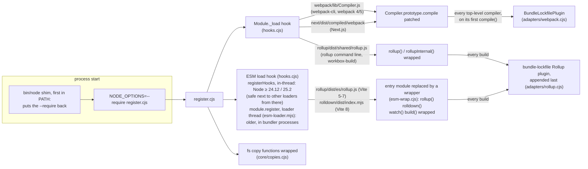
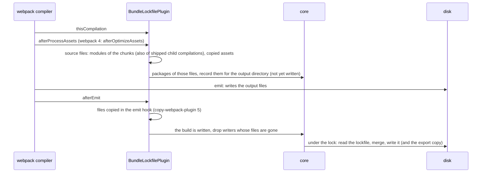
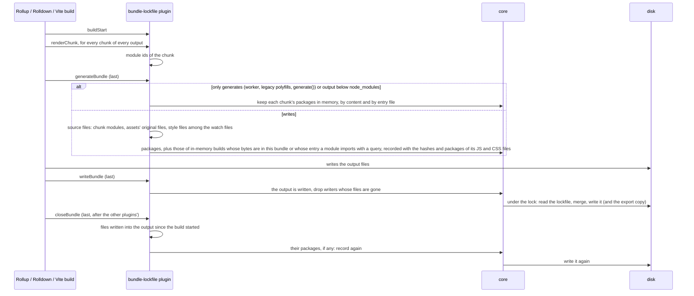
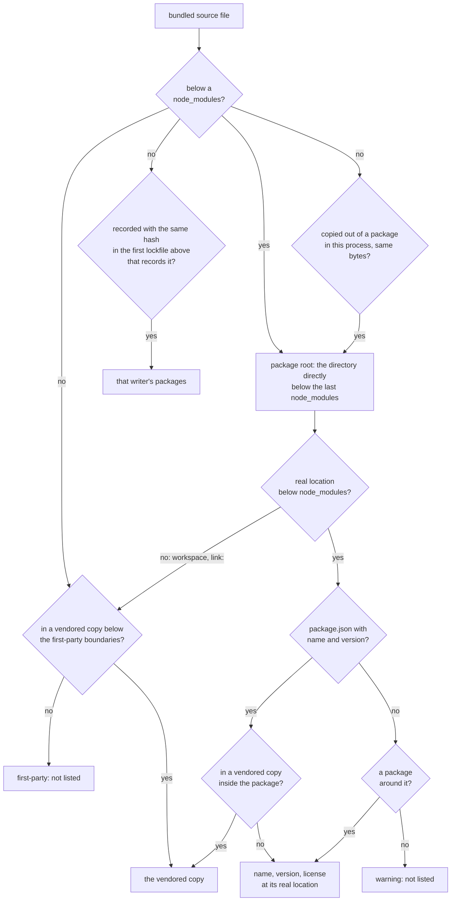
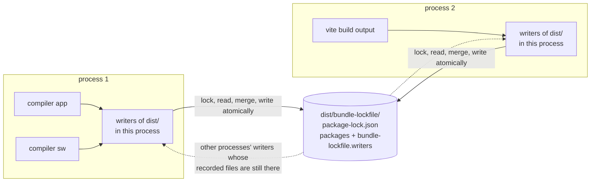

# How bundle-lockfile works

For maintainers. What gets listed, and how to use it, is in the [README](../README.md); the lockfile format is in
[format.md](format.md).

## Getting into the build

`register.cjs`, preloaded with `--require`, runs before the build tool's own code. It installs a hook on
`Module._load` (every `require()`) and, depending on the Node.js version (see [Vite, Rollup,
Rolldown](#vite-rollup-rolldown)), an ESM load hook. Each recognizes a bundler's module when it is loaded and patches
it so that every build gets bundle-lockfile's plugin — without a config change.



## What a build does

Both plugins answer the same question — which source files are in the output this build writes? — and hand the files
to the core, which turns them into packages and the lockfile.



(This is the real disk; with an in-memory output file system the lockfile is a webpack asset, added in
`afterProcessAssets`, and written again in `afterEmit` only if other writers share it or files were copied in the emit
hook; the export copy is written after every build.)



## From files to packages



A file outside `node_modules` that is neither a copy, nor recorded by another build, nor in a vendored copy is
first-party and not listed (see [format.md](format.md#which-package-a-file-belongs-to) for what a vendored copy is and
where the first-party boundaries are; `src/core/vendored.cjs`). Vite, Rollup and Rolldown builds add the packages of
builds that write nothing themselves by the content of their chunks (see the [README](../README.md#what-is-listed)).

## One lockfile, several writers



Within a process, the writers of an output directory live in a registry shared by every copy of bundle-lockfile that
is loaded (on `globalThis`); each has the packages of its last written build and of the build in progress. Every write
of the lockfile renders their last written builds, plus the writers other processes recorded in the lockfile on disk.

## Beyond the chunks' modules

Besides the modules of the written chunks, a lockfile lists the packages of:

- **webpack child compilations whose output is shipped**: emitted next to the bundle (workers built by
  `worker-loader`, workbox's `InjectManifest` service worker) or inlined into a bundled module (`worker-loader`'s
  `inline: 'no-fallback'`). Child compilations that only run at build time (html-webpack-plugin's template,
  mini-css-extract-plugin's loader, vanilla-extract's compiler) are not counted.
- **files copied verbatim into a webpack output**, e.g. by `copy-webpack-plugin`, whose assets record the file they
  were copied from (`info.sourceFilename`, from 6.3 on). Those of copy-webpack-plugin 5 (webpack 4, in the emit hook,
  after the lockfile) and 6.0 – 6.2 (before it) do not: such a file counts as the package file with the same bytes
  that the compilation depends on — a file dependency, or a file below a context dependency in `node_modules` (6.2
  adds a copied directory only as one). webpack 5 minimizes such copies like other assets, so they are matched just
  before its optimize stages. An asset that is a chunk's or a module's file is no copy; a copy that was transformed
  before that matches none.
- **builds that write nothing themselves** (Vite, Rollup, Rolldown): Vite's worker bundles (emitted as files of the
  main build, or inlined with `?worker&inline`), @vitejs/plugin-legacy's polyfills, workbox-build's service worker
  (vite-plugin-pwa), any build that only generates (Rollup's and Rolldown's `generate()`, Vite's `build.write:
  false`). Their chunks' packages are kept in memory, in the process, and listed where the same bytes end up in a
  written output (a chunk or JavaScript asset with that content), or where a module imports the build's entry file
  with a query (`?worker&inline`).
- **style sheets that a style sheet `@import`s from a package** (CSS, Sass, Less, Stylus; inlined into it, so they are
  no modules): in Vite, Rollup and Rolldown builds the style files among the build's watch files. Rolldown provides
  those only on the build object `rolldown()` returns, so Rolldown's `build()` and `watch()` functions — which `vite
  build --watch` on Vite 8 calls — do not list them. In webpack builds the style files among the file dependencies of
  a shipped style module, which its loaders record: Sass partials (sass-loader), Less `@import`s (less-loader),
  postcss-import's and Tailwind's style sheets (postcss-loader).
- **files other plugins write into a Vite, Rollup or Rolldown output after the build** (in a `closeBundle` hook that
  runs before bundle-lockfile's): JavaScript files with the bytes of a chunk of a build that writes nothing itself
  (vite-plugin-pwa's `sw.js` and `workbox-<hash>.js`), and copies of package files (vite-plugin-static-copy); see
  [below](#files-written-after-the-build).
- **copies out of packages** (every bundler): `fs.copyFile`, `fs.copyFileSync`, `fs.cp`, `fs.cpSync` and their
  `fs.promises` versions are wrapped to remember, in the process, which file in `node_modules` a file outside of it
  was copied from (fs-extra and graceful-fs call them, so their copies count). A bundled file, or one written into a
  Vite/Rollup/Rolldown output after the build, that still has the bytes of its source lists the source's package. A
  file written into such an output after the build by another process counts if its path in the output contains
  `node_modules/<package>/` and it has the bytes of that package's file there.
- **nested bundles**: a bundled file outside `node_modules` that another Vite, Rollup or Rolldown build wrote, e.g.
  GitLab's Vite-built "island" `ee/frontend_islands/apps/duo_next/dist/main.js` (Vue inlined), which webpack bundles
  as part of its own code. See [format.md](format.md#nested-bundles).

### Files written after the build

A Vite, Rollup or Rolldown build looks at its output directory again in its `closeBundle` hook, which runs after the
other plugins' (vite-plugin-pwa writes `sw.js` in its own). Rollup runs `closeBundle` on `bundle.close()`, Vite after
the write; a programmatic build that never closes its bundle keeps the lockfile written after its output.
- Only files modified since 2 s before the build started count (for coarse file-system timestamps).
- At most 20,000 entries of the output directory are looked at.
- Files over 20 MiB are compared only if this process copied them with fs.
- An output directory that contains the working directory is not looked at.

## Vite, Rollup, Rolldown

Vite imports Rollup (5–7) and Rolldown (8) as ES modules, which `Module._load` does not see. An ESM hook therefore
replaces their entry modules (`rollup/dist/es/rollup.js`, `@rollup/wasm-node/dist/es/rollup.js`,
`rolldown/dist/index.mjs`) with a wrapper that re-exports everything and wraps `rollup()`, `rolldown()`, `watch()` and
`build()`. Rollup's CommonJS build is patched when it loads (`require('rollup')`, the `rollup` command line,
workbox-build). Either way every call gets one more plugin, last, unless it has one already. That plugin records the
modules of every chunk when it is rendered (also of chunks a plugin removes later, e.g. vite-plugin-singlefile) and
writes the lockfile after the output is written. `vite dev`, `vite preview` and Vitest write no lockfile: they build
nothing with Rollup or Rolldown that is written outside `node_modules` (Vite 8's dependency pre-bundling writes to
`node_modules/.vite`; Vite 5–7 pre-bundle with esbuild).

### Which ESM hook

The ESM hook depends on the Node.js version (`BUNDLE_LOCKFILE_ESM_HOOKS` overrides it):
- Node.js 24.12, 25.2 and later: `module.registerHooks`, in the same thread, in every process. Before those versions,
  in-thread hooks next to any loader-thread hook (Yarn Plug'n'Play's, tsx's) crash the process (fixed by
  [nodejs/node#60380](https://github.com/nodejs/node/pull/60380)).
- Older versions with `module.register` (18.19, 20.6 and later): a loader thread, only in processes whose main script
  belongs to a package that is or depends on `vite`, `rollup`, `rolldown` or `rolldown-vite` — the `vite` command, a
  build script of a project using Vite, tools such as `headlamp-plugin` — or that have another loader-thread hook
  (`--experimental-loader`, `--loader` or `--import` in `NODE_OPTIONS` or on the command line, e.g. Yarn
  Plug'n'Play's, see below), because a loader thread costs time and memory in every process.
  `BUNDLE_LOCKFILE_ESM_HOOKS=async` uses it in every process, `off` in none.

### CommonJS modules a loader hook provides

Node.js loads a CommonJS module without `Module._load` — and everything that module `require()`s — when a
loader-thread hook provided its source. Only the ESM hooks see such modules.

Yarn Plug'n'Play's loader does this for the files in its zip cache on Node.js 22.22.3+, 24.15+, 25.7+ and 26.x
([yarnpkg/berry#7070](https://github.com/yarnpkg/berry/pull/7070), extended to 24.15 by #7104 and to 22.22.3 by
#7141). It works around an
`fstat` failure on its file descriptors that came with [nodejs/node#61769](https://github.com/nodejs/node/pull/61769)
and related loader changes, fixed by [nodejs/node#62835](https://github.com/nodejs/node/pull/62835) in 22.23.3, 24.16
and 26.1; Yarn keeps providing the source on those versions. There, webpack, Next.js' webpack and Rollup's CommonJS
build would not be hooked: webpack-cli 7 `import()`s webpack, and on Node.js 22 Plug'n'Play loads even the main script
that way.

So for the files the adapters patch (`cjsFiles`: webpack's `Compiler`, Next.js' webpack, Rollup's CommonJS build), the
ESM hook appends a line to a provided source that reports the module once it has run, as `Module._load` would. Other
modules and sources are left as they are. A loader-thread hook registered after bundle-lockfile's (an `--import` after
the `--require`) that provides the source without calling the next hook hides it.

## webpack: which file a module is

A module counts as the file webpack itself names it by (its `nameForCondition`: the path `module.rules` match it
against, also used by `splitChunks` cache-group tests): its resource, or the match resource of a
`<name>!=!<loaders>!<file>` request. Loaders that generate a module from a placeholder file name it that way:
vanilla-extract's CSS reads a placeholder in `@vanilla-extract/webpack-plugin`, which is therefore not listed. A
package file pulled in under a first-party match resource is not listed either.

## Files

```
src/register.cjs        NODE_OPTIONS entry point: registers the adapters, installs the hooks and the fs copy wrappers
bin/node                node shim for builds whose scripts overwrite NODE_OPTIONS
src/hooks.cjs           module-load hooks shared by the adapters: Module._load, and the ESM hooks (in-thread, or the
src/esm-loader.mjs        loader thread) that replace entry modules by the wrappers esm-wrap.cjs generates
src/esm-wrap.cjs
src/adapters/webpack.cjs  webpack 4/5 and Next.js: which source files are in a compiler's emitted output
src/adapters/rollup.cjs   Rollup, Rolldown, Vite: which source files are in a build's written outputs
src/core/packages.cjs   source files -> packages (package.json), also those inside files another build wrote
src/core/manifest.cjs   a package directory's package.json: name, version, license
src/core/vendored.cjs   vendored copies inside packages and outside node_modules, the first-party boundaries
src/core/paths.cjs      package directory of a file by its path (real location, Yarn PnP virtual paths), export path
src/core/copies.cjs     files copied with fs in this process: out of packages, and copies of lockfiles
src/core/generated.cjs  packages of builds that write nothing themselves, by content and entry file
src/core/nested.cjs     packages of bundled files another build wrote (output hashes in its lockfile)
src/core/hashes.cjs     SHA-256 of output files, cached by size and mtime
src/core/lru.cjs        bounded maps for the caches above
src/core/outputs.cjs    writers of each lockfile, in this process and others; writes, export copies
src/core/lock.cjs       lock across processes, atomic writes
src/core/lockfile.cjs   package-lock.json (lockfileVersion 3, see format.md) and its "bundle-lockfile" record
src/core/config.cjs     settings (environment variables), debug and warning output
```

Adapters must never break a build: their failures are reported on stderr and the build continues.

To add a bundler:
1. Write `src/adapters/<name>.cjs` (the interface is described at the top of `src/hooks.cjs`):
   - `name` (or `names`, if it serves several bundlers, for `BUNDLE_LOCKFILE_DISABLE`);
   - for a CommonJS bundler: `onCjsLoad(exports, request, resolve)`, which recognizes and patches it, and `cjsFiles`,
     the files it patches, which the ESM hooks report when Node loads them without `Module._load`;
   - for an ES module one: `esmEntries`, `esmWrap` and `esmPackages` (the packages whose processes get the
     loader-thread hooks);
   - write through `core/outputs.cjs`, so that shared output directories work.
2. Add it to `ADAPTERS` in `src/register.cjs`.
3. Add an app under `test/apps/`, an oracle under `test/oracles/` and rows to `test/matrix.cjs` (see
   [test/README.md](../test/README.md)).
